This project utilizes Salesforce CRM and Tableau to analyse the business of a gym that is currently in need of a business transformation to improve its sales and reach. 

**Salesforce**

The Contacts tab in Salesforce shows all existing customers associated with an account.
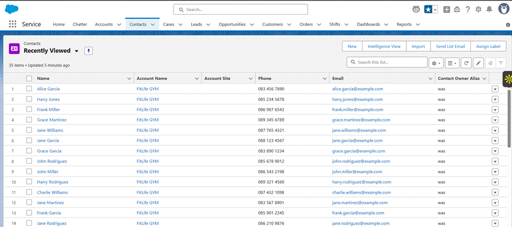

Once all the member details are stored in the CRM, targeted marketing and campaigning can be carried out by segregating the members into different groups.

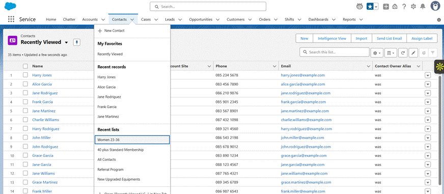

The Leads tab is where potential customers for the business are stored.
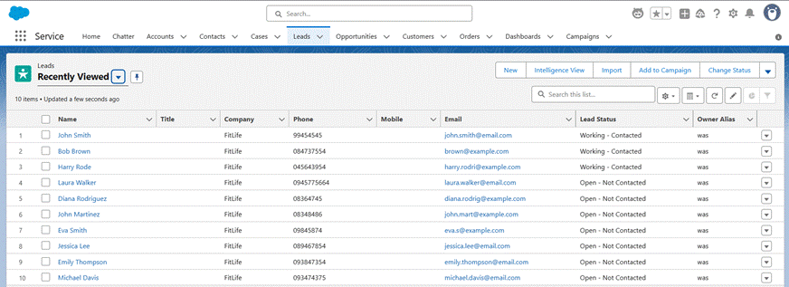

Leads, once successful can be converted to contacts.

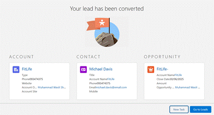

Opportunities drive sales. It represents a potential revenue or sales that we are tracking. It works by following a potential amount of revenue to be generated by those sales.

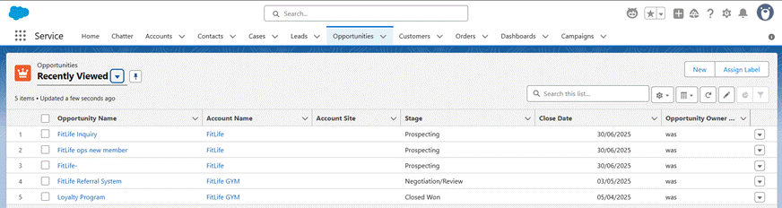
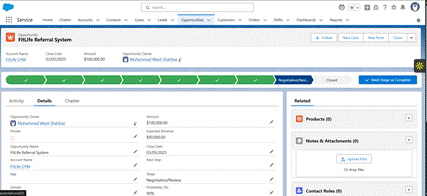

The Cases tab is where the queries or issues that the customers have raised will be recorded with details like the name of the customer, their details, their case details, the status of the case, and the priority.
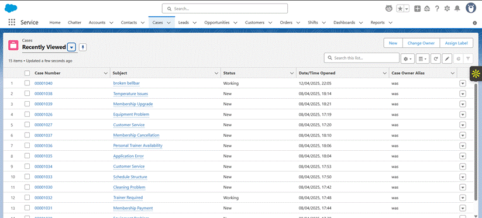
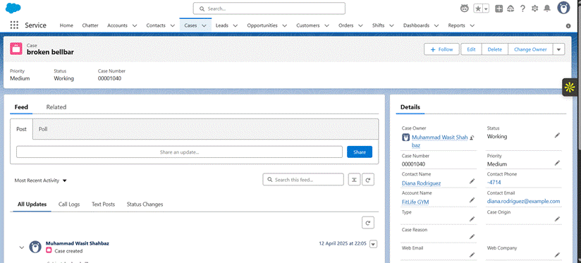

Campaigns are launched to increase marketing and sales reach; to all the customers by promoting a specific activity or product. The results of a campaign tell us how successful that product or activity was and how it drove sales.
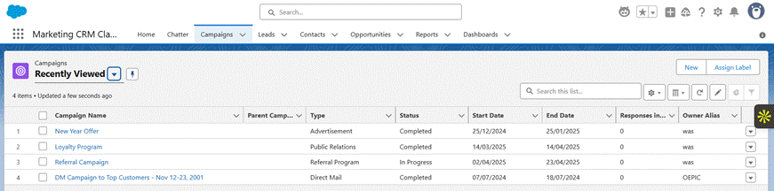
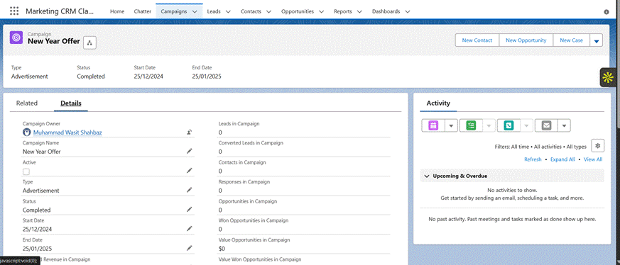

Chatter in Salesforce is where the intercommunication between the employees occurs. It has three options, Poll, Question, and Post, where questions can be asked to other employees, important announcements and alerts can be posted, and polls can be generated to get the votes on different choices. 

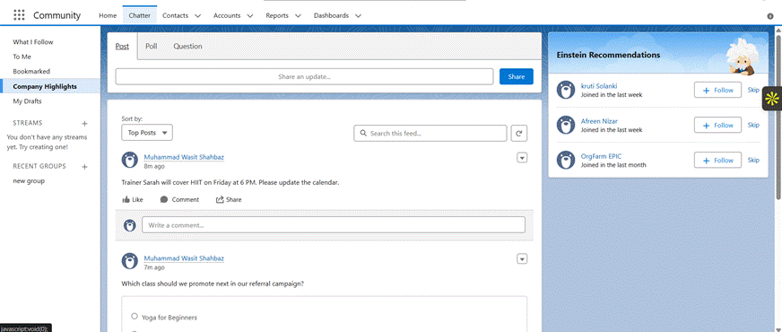

**Tableau**

Member demographics provides insights into the member distribution across different segments.
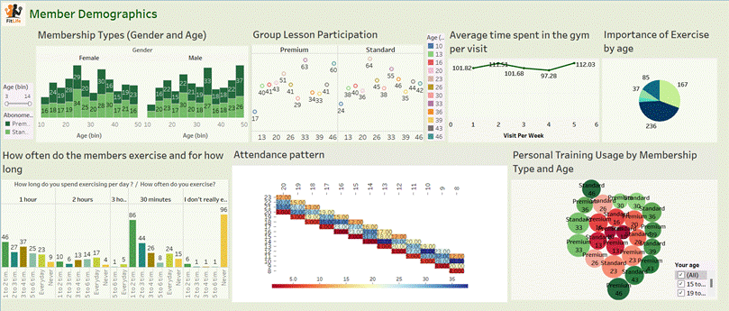

Customer Behaviour Analysis provides insights into the member preferences, their motivation, behaviour, and engagement patterns.

  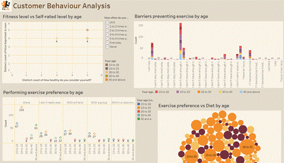
  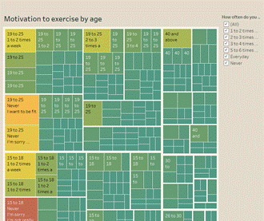
  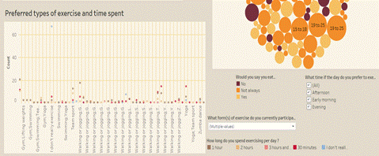
  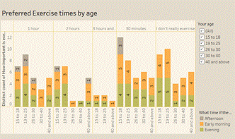

Revenue distribution provides insight into the revenue generating components as well as members’ exercise patterns with the trainers.
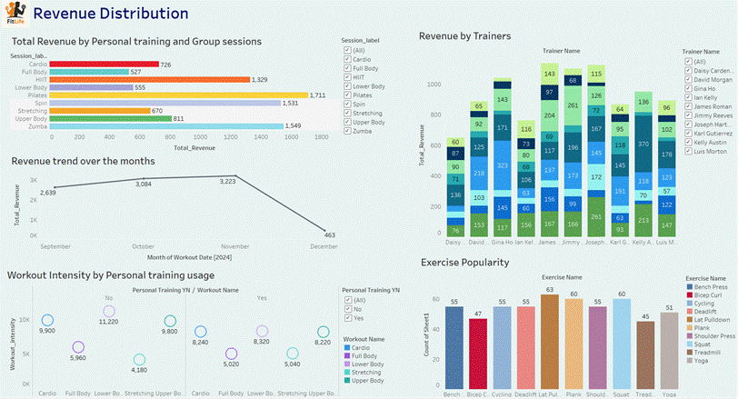
